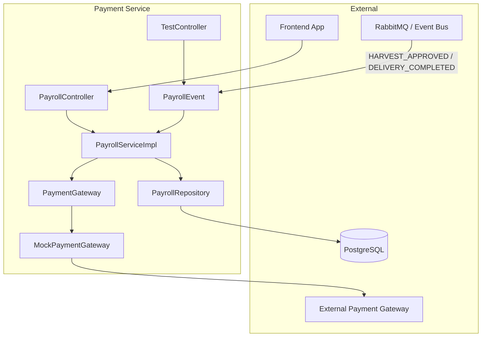
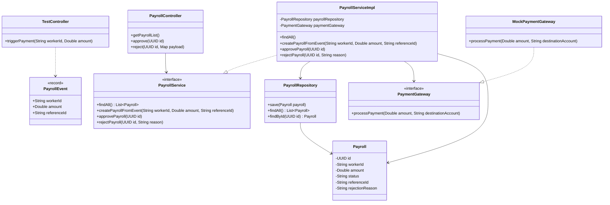

# Payment Service - Payroll Feature

## Menjalankan Service

Gunakan Docker Compose untuk menjalankan service:

```bash
docker compose up --build
```

---

# Payroll Feature Documentation

## Deskripsi Fitur

Fitur Payroll digunakan untuk mengelola data pembayaran pekerja yang dibuat secara otomatis berdasarkan event dari sistem panen (*harvest*) dan pengiriman (*delivery*).

Service ini menggunakan pendekatan **event-driven architecture** dengan memanfaatkan RabbitMQ sebagai message broker.

---

# Entity Payroll

## Tabel: `payrolls`

| Field              | Type   | Keterangan |
|-------------------|--------|------------|
| id                | UUID   | Primary Key |
| worker_id         | String | ID pekerja yang menerima bayaran |
| amount            | Double | Jumlah bayaran |
| status            | String | Status pembayaran (`PENDING`, `APPROVED`, `REJECTED`) |
| reference_id      | String | ID referensi dari Harvest/Delivery |
| rejection_reason  | String | Alasan penolakan pembayaran |

---

# Arsitektur Sistem (C4 Model)

## Component Diagram

Diagram berikut menunjukkan hubungan antar komponen pada Payment Service serta interaksinya dengan RabbitMQ dan PostgreSQL.



---

# Code Diagram (Class Diagram)

Diagram berikut menggambarkan struktur class utama pada modul Payroll.


---

# Penjelasan Alur Sistem

## 1. Event Masuk dari RabbitMQ

Ketika event `HARVEST_APPROVED` dikirim dari sistem Harvest ke RabbitMQ, komponen `PaymentSubscriber` akan menerima event tersebut.

Event ini berisi data:

- `workerId`
- `amount`
- `referenceId`

yang direpresentasikan dalam bentuk `PayrollEvent`.

---

## 2. Pembuatan Payroll

`PaymentSubscriber` akan meneruskan data event ke `PayrollServiceImpl`.

Method:

```java
createPayroll(PayrollEvent event)
```

akan:

1. Membuat object `Payroll`
2. Mengisi data pembayaran pekerja
3. Memberikan status default `PENDING`
4. Menyimpan data ke database melalui `PayrollRepository`

---

## 3. Approve Payroll

Admin dapat melakukan approval pembayaran menggunakan method:

```java
approvePayroll(UUID id)
```

Method ini akan mengubah status payroll menjadi:

```text
APPROVED
```

---

## 4. Reject Payroll

Admin juga dapat menolak pembayaran menggunakan method:

```java
rejectPayroll(UUID id, String reason)
```

Method ini akan:

- Mengubah status menjadi `REJECTED`
- Menyimpan alasan penolakan pada field `rejection_reason`

---

# Korelasi Antar Komponen

| Komponen | Fungsi |
|----------|--------|
| PayrollEvent | Menampung data event dari RabbitMQ |
| PaymentSubscriber | Mendengarkan event dari broker |
| PayrollServiceImpl | Memproses business logic payroll |
| PayrollRepository | Mengakses database PostgreSQL |
| PayrollController | Endpoint API untuk approval/rejection |
| Payroll | Entity utama penyimpanan data payroll |

---

# Kesimpulan

Fitur Payroll pada Payment Service menggunakan pendekatan event-driven untuk menghasilkan data pembayaran secara otomatis berdasarkan aktivitas panen dan pengiriman.

RabbitMQ digunakan sebagai penghubung antar service, sedangkan PostgreSQL digunakan untuk menyimpan data payroll secara permanen.

Struktur ini membuat sistem lebih modular, scalable, dan mudah dikembangkan untuk integrasi microservices di masa depan.
